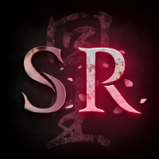

<h3 align="center">
     
        <kbd></kbd>
     
</h3>

    <h3 align="center">Welcome to the <b>Official Wiki</b> for <b><big>SEKIRO: RESURRECTION</big></b>.</h3>

 
<h5 align="center">This resource is curated and maintained by the <b><a href="">project development team</a></b> and <b><a href="https://discord.gg/pRz8pQAbUz">supporting community</a></b>. </h5>

    <kbd></kbd>

 

<b>📖 TABLE OF CONTENTS</b>

 

 
<ol>
    <li><a style="font-size: 105%" href="#description">About The Mod</a></li>
    <li><a style="font-size: 105%" href="#installation">How To Install</a></li>
    <ul>
        <li><a style="font-size: 95%" href="#quickstart-guide">Quickstart Installation Guide</a></li>
        <ul>
            <li><a style="font-size: 85%" href="#github-releases">Accessing Current Patches</li>
            <li><a style="font-size: 85%" href="#nexus-releases">Accessing Stable Releases</li>
        </ul>
        <li><a style="font-size: 95%" href="#written-guide">Written Installation Tutorial</a></li>
        <li><a style="font-size: 95%" href="#guide-by-melody">Video Installation Tutorial</a></li>
    </ul>
    <li><a style="font-size: 105%" href="#changelog">Updated Changelog</a></li>
    <ul>
        <li><a style="font-size: 95%" href="changelog/01-general-and-player/README.md">General/Player Changes</a></li>
        <li><a style="font-size: 95%" href="changelog/02-gameplay-mechanics/README.md">Gameplay Mechanics</a></li>
        <li><a style="font-size: 95%" href="changelog/03-combat-arts/README.md">Combat Art Overhauls</a></li>
        <li><a style="font-size: 95%" href="changelog/04-prosthetic-arts/README.md">Prosthetic Art Overhauls</a></li>
        <li><a style="font-size: 95%" href="changelog/05-basic-enemies/README.md">Basic Enemies</a></li>
        <li><a style="font-size: 95%" href="changelog/06-unique-enemies/README.md">Bosses and Minibosses</a></li>
        <li><a style="font-size: 95%" href="changelog/07-world-design/README.md">World Design Improvements</a></li>
        <li><a style="font-size: 95%" href="changelog/08-quests-and-NPCs/README.md">Changes to NPCs and Quests</a></li>
    </ul>
    <li><a style="font-size: 105%" href="#acknowledgements">Credits and Acknowledgements</a></li>
    <li><a style="font-size: 105%" href="license">License</a></li>
</ol>

 

 

<h2 id="description"> ⛩ <b>About The Mod</b></h2>

<b>Sekiro: Resurrection</b> is a complete overhaul of the base game, intended on providing a challenging and content-rich experience for veteran players. 

The project is designed to be as lore-friendly and dynamically balanced as possible – with additions including (but not limited to) new combat mechanics, enemy encounters, boss movesets, and map redesigns. 

Please join the <a href="https://discord.gg/pRz8pQAbUz"><b>Sekiro: Resurrection Discord Server</b></a> to get access to the newest beta releases and engage with the rest of the community!

 

<h2 id="installation"> ⛩ <b>How To Install</b></h2>

The following section will detail steps and methodologies in getting appropriate mod files and setting them up to ensure optimal gameplay accessability.

 

<h3 id="quickstart-guide"><b> 📌 Quickstart Installation Guide</b></h3>

There are two primary ways to access the Sekiro: Resurrection mod files.

<h4 id="github-releases"><b> 🚩 Accessing Current Patches</b></h4>

Newest mod versions are frequently released via <a href="https://github.com/SekiroResurrection/Sekiro-Resurrection"><b>GitHub</b></a>; versions uploaded here maintain the most up-to-date changes and bug fixes, but may not be as stable as major patch editions.

<h4 id="nexus-releases"><b> 🚩 Accessing Stable Releases</b></h4>

Stable mod versions will be released via <a><b>Nexus Mods</b></a>; versions uploaded here are exhaustively tested for stability but are not regularly updated with new patch data and will likely be out-of-date from the most recently worked-on versions. 

<b><i>It is highly recommended to download current release versions via GitHub to get access to newest content.</i></b>

 

<h3 id="written-guide"><b> 📌 Written Installation Tutorial</b></h3>

Once you have the relevant mod files, you'll need to follow the following steps to ensure correct installation and configuration of the mod with your Sekiro game.

<ol>
    <li>Download the <a href="https://www.nexusmods.com/sekiro/mods/6"><b>Sekiro Mod Engine</b></a> – this is a required dependency needed to unpack/extract our mod files for appropriate placement and usage.</li>
    <li>Extract the contents of the Sekiro Mod Engine into your main game directory.</li>
    <li>Make a folder called `mods` (if it doesn't already exist).</li>
    <ul>
        <li>If you already have a folder called `mods` with preexisting files, then you may be trying to download or set up multiple mods at once. If so, please reach out for support in the Sekiro: Resurrection Discord to ensure proper merging and compatability.</li>
    </ul>
    <li>Extract the contents of the Resurrection mod into your newly created `mods` folder.</li>
    <li>Boot up your copy of Sekiro and have fun!</li>
</ol>

 

<h3 id="guide-by-melody"><b> 📌 Video Installation Tutorial</b></h3>

For a more detailed visual walkthrough of how to install, set up, and test your copy of Sekiro: Resurrection, watch the following video tutorial by <a href=""><b>@melodious-shark</b></a>, a resident modder and project contributor!

<h3 align="center">
    <figure>
        <a href="https://www.youtube.com/watch?feature=player_embedded&v=SOGHTE6jXA4" target="_blank">
            <kbd></kbd>
        </a>
        <h5><i>Video tutorial on installing Sekiro: Resurrection.</i></h5>
    </figure>
</h3>

<!--  -->

 

<h2 id="changelog"> ⛩ <b>Updated Changelog</b></h2>

Lorem ipsum dolor sit amet.

 

<h2 id="acknowledgements"> ⛩ <b>Credits and Acknowledgements</b></h2>

Lorem ipsum dolor sit amet.

 

<h2 id="license"> ⛩ <b>License</b></h2>

Licensed under [MIT](https://opensource.org/licenses/MIT).
